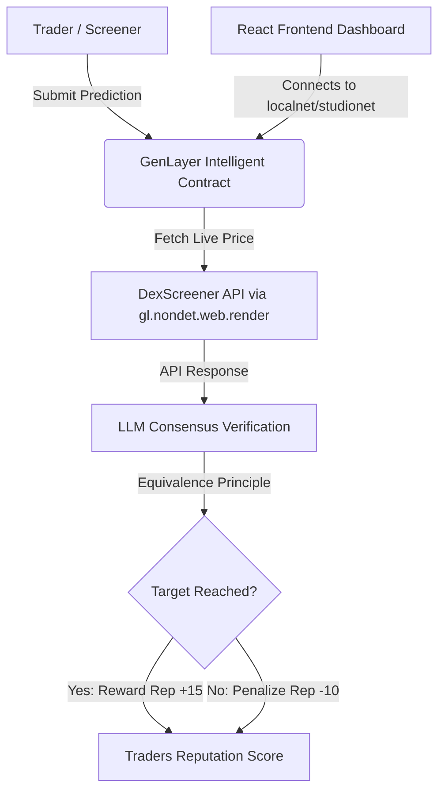

# 🔍 Check — On-Chain Trading Signal Accountability & Reputation Tracker

Check is a decentralized dashboard and intelligence platform that tracks smart-money activity, calculates signal accuracy, and records trader reputation on-chain using **GenLayer Intelligent Contracts**.

By combining real-time on-chain simulation, natural language processing, and decentralized web consensus, Check makes crypto-trading signals fully accountable and verifiable.

---

## ✨ Features

- **📊 Real-time Inflow Monitor**: Track wallet swaps, liquidity inflows, and smart-money token overlap ratios.
- **🎯 Signal Screener**: Identify high-probability trading signals based on wallet cluster overlaps.
- **🤖 On-Chain Signal Submission**: Connect your GenLayer wallet to log signal targets (symbol, entry price, target price) directly onto the GenLayer blockchain.
- **🧠 Intelligent Validator Consensus**: Leverages GenLayer validators to fetch live price data from the **DexScreener API** and reach consensus using LLMs to verify if targets were hit.
- **🏆 Smart Leaderboard**: Tracks traders' on-chain reputation based on historical accuracy. Points are awarded (+15 rep) for successful predictions and deducted (-10 rep) for failed ones.
- **🕹️ Simulation Console**: Play, pause, or speed up simulated market trades to watch the screener adapt in real time.

---

## 🏗️ Architecture



### 1. Intelligent Smart Contract (`contracts/check_signals.py`)
Written for the **GenLayer Blockchain**, this contract is capable of non-deterministic web requests and LLM prompt execution.
- **Non-Deterministic Web Access**: Uses `gl.nondet.web.render()` to pull live token metrics from DexScreener.
- **Equivalence Principle Consensus**: Leverages `gl.eq_principle.prompt_comparative()` to evaluate the JSON response of multiple validator nodes. It enforces validation consensus on whether the price hit the target, while allowing minor differences in the reason string.

### 2. Frontend Dashboard (`src/`)
Built with **React**, **Vite**, and **TailwindCSS**:
- **`src/App.jsx`**: Main dashboard frame managing simulation loops, UI routing, and syncing GenLayer state.
- **`src/components/`**: Modular UI components:
  - `InflowMonitor`: Visualizes recent transactions and wallet overlaps.
  - `SignalScreener`: Displays active market signals with an on-chain verification trigger.
  - `SmartLeaderboard`: Shows the reputation board for traders.
  - `SimulationConsole`: Controls the mock market feed.
- **`src/lib/genlayerClient.js`**: Integrates `genlayer-js` to establish contract connections, read signals, and dispatch write transactions.

---

## 🚀 Getting Started

### 📋 Prerequisites
- **Node.js** (v18 or higher)
- **Git**
- **MetaMask** or **Rabby Wallet** (configured to connect to GenLayer Localnet or Studionet)

### 💻 Installation
1. Clone the repository and navigate to the project directory:
   ```bash
   git clone https://github.com/KennyGodman/Check.git
   cd Check
   ```

2. Install the frontend dependencies:
   ```bash
   npm install
   ```

3. Launch the development server:
   ```bash
   npm run dev
   ```
   Open [http://localhost:5173](http://localhost:5173) in your browser.

---

## ⛓️ Smart Contract Deployment

To deploy the intelligent contract to your local GenLayer node or Studionet:

1. Build or test the contract code using GenLayer tools:
   ```bash
   # Make sure you have python-genlayer SDK installed
   # Test contract locally
   genlayer test contracts/check_signals.py
   ```

2. Deploy the contract:
   ```bash
   genlayer deploy contracts/check_signals.py
   ```

3. Copy the deployed contract address and set it in your environment variables:
   Create a `.env` file in the root directory:
   ```env
   VITE_CONTRACT_ADDRESS="your_deployed_contract_address_here"
   VITE_NETWORK="localnet" # or "studionet"
   ```

---

## 🎨 Technology Stack
- **Framework**: [Vite](https://vite.dev/) + [React](https://react.dev/)
- **Styling**: [Tailwind CSS](https://tailwindcss.com/)
- **Web3 Integration**: [genlayer-js](https://www.npmjs.com/package/genlayer-js) (v1.1.8)
- **Icons**: [Lucide React](https://lucide.dev/)
