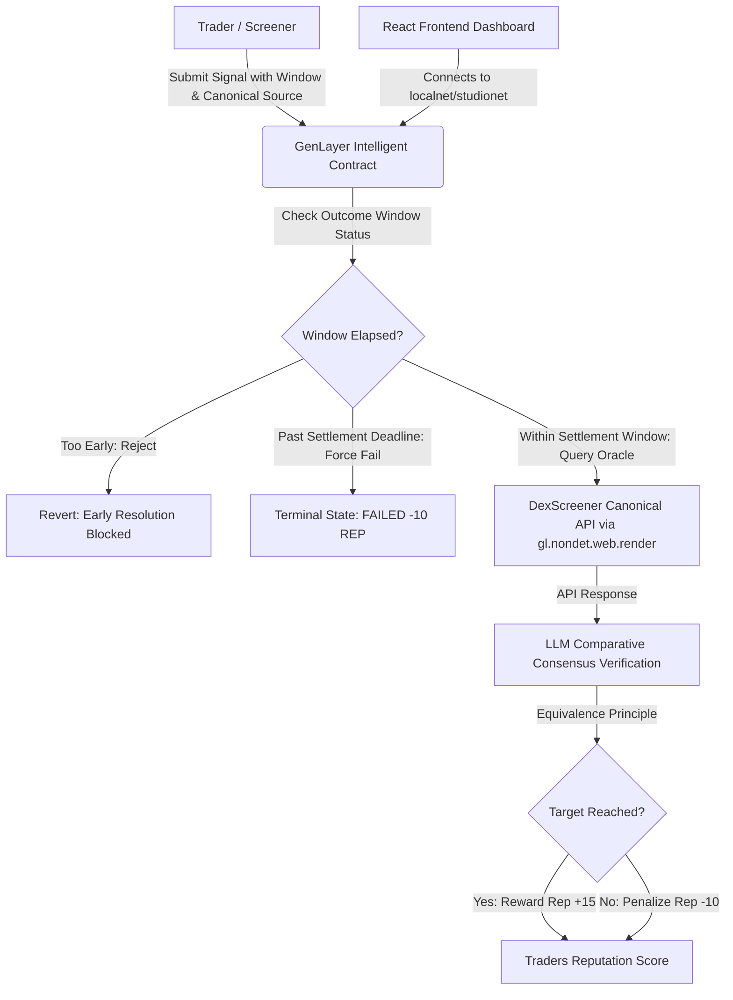

# 🔍 Check — On-Chain Trading Signal Accountability & Reputation Tracker

Check is a decentralized intelligence and reputation platform that tracks smart-money activity, calculates signal accuracy, and records trader reputation on-chain using **GenLayer Intelligent Contracts**.

By combining real-time on-chain verification, natural language processing, and decentralized web consensus, Check makes crypto-trading signals fully accountable and ungameable.

---

## 🛡️ Anti-Gaming & Strict Accountability Architecture

Check enforces cryptographic and game-theoretic guarantees to prevent reputation gaming:

1. **Fixed Outcome Window**:
   - Each signal binds to an immutable `timestamp`, `prediction_window` (e.g. 5 minutes), and a `settlement_deadline` (`timestamp + window + grace_period`).
   - **Early Resolution Blocked**: Attempting to resolve a signal before the prediction window has completed is rejected by the smart contract to prevent premature reputation farming.
   - **No Arbitrarily Late Spot Price Gaming**: If a signal is resolved after its `settlement_deadline` has passed, it is strictly classified as an **expired/unverified signal** and forced to **`FAILED`** with a reputation penalty (`-10 REP`). Traders cannot wait weeks for a token to pump and cherry-pick resolution on an expired short-term forecast.

2. **Canonical Price Source Binding & 4-Point Oracle Validation**:
   - **No Arbitrary Caller URLs**: `submit_signal` rejects arbitrary URLs. The canonical endpoint is strictly bound and constructed against the trusted host `https://api.dexscreener.com/` and the target token, chain, and pair.
   - **Host Validation**: Asserts that resolution only executes against `https://api.dexscreener.com/`.
   - **Token Validation**: Asserts that `baseToken.address` and `baseToken.symbol` in the returned pairs match the registered token on-chain.
   - **Chain Validation**: Asserts that `chainId` of the pair matches the registered blockchain network (`solana`, `ethereum`, `base`, etc.).
   - **Pair Validation**: Binds the explicit `pair_address` or extracts priceUsd from the primary verified high-liquidity pool, preventing spoofed low-liquidity pairs or cross-chain price manipulation.
   - **Equivalence Principle Consensus**: Multi-validator consensus on all 4 validation flags (`host_valid`, `token_matched`, `chain_matched`, `pair_matched`), `canonical_price`, and `meets_target`. Failure of any dimension automatically results in terminal `FAILED`.

3. **Guaranteed Terminal Results & Permissionless Keeper Sweeper**:
   - **Permissionless Settlement**: ANY wallet, keeper, or validator can call `resolve_signal` or `force_resolve_expired` once the prediction window has passed.
   - **No Lingering Pending Signals**: Abandoned or losing signals cannot sit in `pending` to avoid reputation deductions.
   - **Sweeper Crank**: Includes single and batch force-resolution functions (`force_resolve_expired`, `onSweepExpiredSignals`) so keepers can sweep all expired pending signals to terminal failure with one click.

---

## ✨ Features

- **📊 Real-time Inflow Monitor**: Track wallet swaps, liquidity inflows, and smart-money token overlap ratios.
- **🎯 Signal Screener**: Identify high-probability trading signals based on wallet cluster overlaps.
- **🤖 On-Chain Signal Submission**: Connect your GenLayer wallet to log signal targets (symbol, entry price, target price, canonical source, window) directly onto the GenLayer blockchain.
- **🧠 Intelligent Validator Consensus**: Leverages GenLayer validators to fetch live price data from the designated **DexScreener API** endpoint and reach consensus using LLMs to verify if targets were hit within the window.
- **🏆 Smart Leaderboard**: Tracks traders' on-chain reputation based on historical accuracy (+15 REP for success, -10 REP for failure or expired abandonment).
- **🕹️ Simulation Console**: Play, pause, or speed up simulated market trades to watch the screener adapt in real time.

---

## 🏗️ Architecture



### 1. Intelligent Smart Contract (`contracts/check_signals.py`)
Written for the **GenLayer Blockchain**, this contract is capable of non-deterministic web requests and LLM prompt execution.
- **Non-Deterministic Web Access**: Uses `gl.nondet.web.render()` to pull live token metrics from the canonical DexScreener endpoint.
- **Equivalence Principle Consensus**: Leverages `gl.eq_principle.prompt_comparative()` to evaluate the JSON response of multiple validator nodes. It enforces validation consensus on whether the price hit the target, while allowing minor differences in the reason string.
- **Permissionless Keeper & Sweeper**: Includes `force_resolve_expired()` to force terminal failure on stale/abandoned signals.

### 2. Frontend Dashboard (`src/`)
Built with **React**, **Vite**, and **TailwindCSS**:
- **`src/App.jsx`**: Main dashboard frame managing simulation loops, UI routing, and syncing GenLayer state.
- **`src/components/`**: Modular UI components:
  - `InflowMonitor`: Visualizes recent transactions and wallet overlaps.
  - `SignalScreener`: Displays active market signals with real-time outcome window countdowns, canonical source tags, and a 1-click **Sweep Expired Signals** keeper trigger.
  - `SmartLeaderboard`: Shows the reputation board for traders.
  - `SimulationConsole`: Controls the mock market feed.
- **`src/lib/genlayerClient.js`**: Integrates `genlayer-js` to establish contract connections, read signals, and dispatch write transactions.

---

## 🚀 Getting Started

### 📋 Prerequisites
- **Node.js** (v18 or higher)
- **Git**
- **MetaMask** or **Rabby Wallet** (configured to connect to GenLayer Localnet or Studionet)

### 💻 Installation
1. Clone the repository and navigate to the project directory:
   ```bash
   git clone https://github.com/KennyGodman/Check.git
   cd Check
   ```

2. Install the frontend dependencies:
   ```bash
   npm install
   ```

3. Launch the development server:
   ```bash
   npm run dev
   ```
   Open [http://localhost:5173](http://localhost:5173) in your browser.

---

## 🧪 GenVM Contract Validation & Testing

To run the automated validation suite and verify compliance with GenVM storage standards:

```bash
# Run the reproducible GenVM static analysis, storage decorator check, and deployment verification
npm test
# or
npm run check:contract
```

### Direct GenLayer Deployment Verification
```bash
npx genlayer deploy --contract contracts/check_signals.py --rpc https://studio.genlayer.com/api
```

---

## ⛓️ Smart Contract Deployment

To deploy the intelligent contract to your local GenLayer node or Studionet:

1. Test contract static storage structure & deployment:
   ```bash
   npm run check:contract
   ```

2. Deploy the contract directly via GenLayer CLI:
   ```bash
   npx genlayer deploy --contract contracts/check_signals.py --rpc https://studio.genlayer.com/api
   ```

3. Copy the deployed contract address and set it in your environment variables:
   Create a `.env` file in the root directory:
   ```env
   VITE_CONTRACT_ADDRESS="your_deployed_contract_address_here"
   VITE_NETWORK="studionet"
   ```

---

## 🎨 Technology Stack
- **Framework**: [Vite](https://vite.dev/) + [React](https://react.dev/)
- **Styling**: [Tailwind CSS](https://tailwindcss.com/)
- **Web3 Integration**: [genlayer-js](https://www.npmjs.com/package/genlayer-js) (v1.1.8)
- **Icons**: [Lucide React](https://lucide.dev/)
